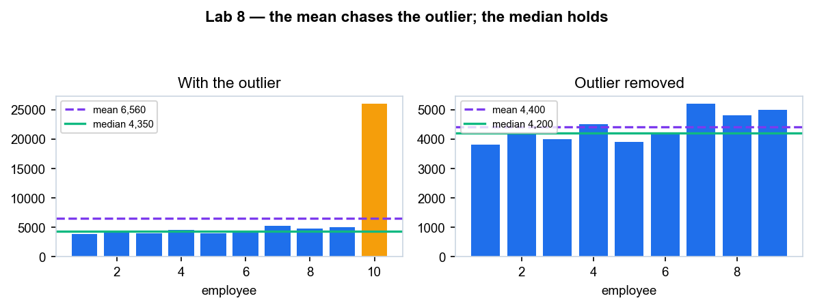
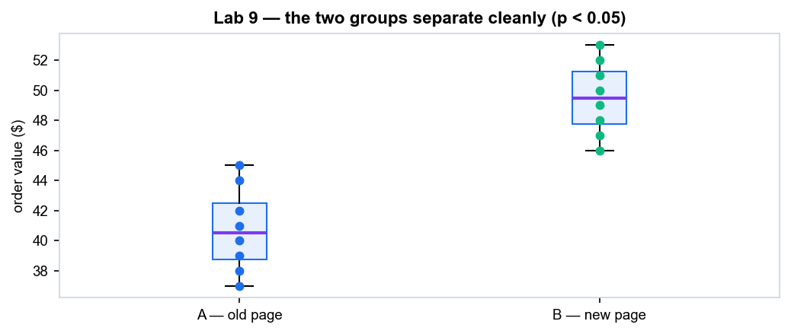
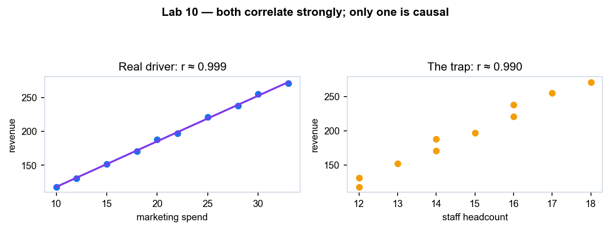
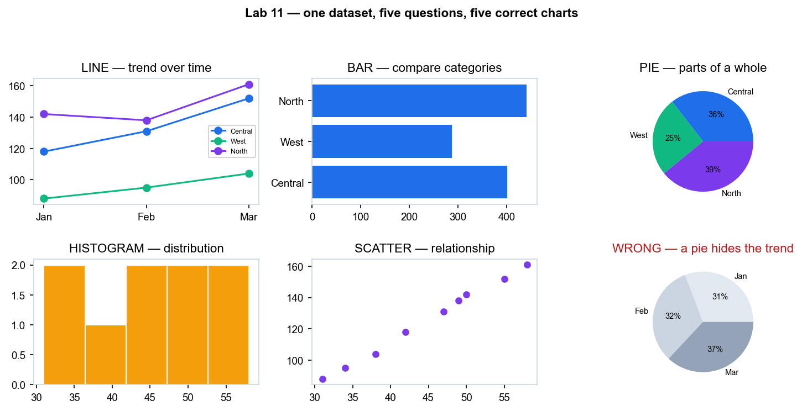
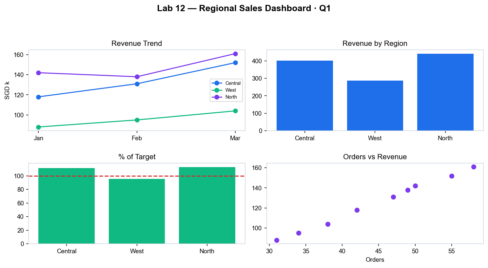

# WSQ - CompTIA Certified Data+ Training — Learner Guide

**WSQ Course Code:** TGS-2024049212  |  **Conducted by:** Tertiary Infotech Academy Pte Ltd (UEN 201200696W)  |  **Version v5.0 · 19 August 2026**

## Contents

- [Introduction](#introduction)
- [Course Learning Outcomes](#course-learning-outcomes)
- [Before You Start — Environment Setup](#before-you-start--environment-setup)
- [Domain 01 — Data Concepts and Environments  (20% of the exam)](#domain-01--data-concepts-and-environments--20-of-the-exam)
  - [Lab 1 — Build a Relational Schema and Prove Referential Integrity](#lab-1--build-a-relational-schema-and-prove-referential-integrity)
  - [Lab 2 — Compare Structured, Semi-Structured and Unstructured Data](#lab-2--compare-structured-semi-structured-and-unstructured-data)
  - [Lab 3 — Profile Machine/Log Data as a Data Source (PCAP Analyzer)](#lab-3--profile-machinelog-data-as-a-data-source-pcap-analyzer)
- [Domain 02 — Data Acquisition and Preparation  (22% of the exam)](#domain-02--data-acquisition-and-preparation--22-of-the-exam)
  - [Lab 4 — Explore a Dirty Dataset: Missing Values, Duplicates and Outliers](#lab-4--explore-a-dirty-dataset-missing-values-duplicates-and-outliers)
  - [Lab 5 — Build Parsing Patterns in RegexLab and Apply Them](#lab-5--build-parsing-patterns-in-regexlab-and-apply-them)
  - [Lab 6 — Derive Structured Fields from Raw Address Data (IP Calculator)](#lab-6--derive-structured-fields-from-raw-address-data-ip-calculator)
  - [Lab 7 — Integrate Multiple Datasets with SQL Joins and Cleanse the Result](#lab-7--integrate-multiple-datasets-with-sql-joins-and-cleanse-the-result)
- [Domain 03 — Data Analysis  (24% of the exam)](#domain-03--data-analysis--24-of-the-exam)
  - [Lab 8 — Descriptive Statistics and the Outlier That Moves the Mean](#lab-8--descriptive-statistics-and-the-outlier-that-moves-the-mean)
  - [Lab 9 — Hypothesis Testing: t-test, p-value and the Two Error Types](#lab-9--hypothesis-testing-t-test-p-value-and-the-two-error-types)
  - [Lab 10 — Correlation, Regression and the Causation Trap](#lab-10--correlation-regression-and-the-causation-trap)
- [Domain 04 — Visualization and Reporting  (20% of the exam)](#domain-04--visualization-and-reporting--20-of-the-exam)
  - [Lab 11 — Choose the Right Chart: Five Questions, Five Chart Types](#lab-11--choose-the-right-chart-five-questions-five-chart-types)
  - [Lab 12 — Build a KPI Dashboard and Validate Its Accuracy](#lab-12--build-a-kpi-dashboard-and-validate-its-accuracy)
- [Domain 05 — Data Governance, Quality and Controls  (14% of the exam)](#domain-05--data-governance-quality-and-controls--14-of-the-exam)
  - [Lab 13 — Classify, Mask and De-Identify a Dataset (PDPA/GDPR)](#lab-13--classify-mask-and-de-identify-a-dataset-pdpagdpr)
  - [Lab 14 — Assess Data-Leakage Risk and Set Access Controls](#lab-14--assess-data-leakage-risk-and-set-access-controls)
  - [Lab 15 — Automated Quality Assurance: Profile, Rule, Monitor](#lab-15--automated-quality-assurance-profile-rule-monitor)
- [Exam Focus — Cross-Cutting Topics](#exam-focus--cross-cutting-topics)
- [Exam Preparation](#exam-preparation)
- [Glossary](#glossary)


## Introduction

This Learner Guide accompanies the WSQ course WSQ - CompTIA Certified Data+ Training (TGS-2024049212), conducted by Tertiary Infotech Academy Pte Ltd. It provides detailed step-by-step instructions for all 15 hands-on labs, organised by the five official CompTIA Data+ (DA0-001) exam domains. Every lab maps to a published exam objective and to the course Learning Outcomes (LO1-LO5) approved under the Skills Framework TSC Data Analytics (ATP-PIN-3001-1.1).

Use this guide alongside the course slides and the lab files in the labs/ folder of the course repository. The slides carry the concepts and the visual explanations; this guide carries the full click-by-click and command-by-command procedure for every lab, together with the expected result and a troubleshooting table. Work through the labs in order — each one builds on a technique established in the labs before it.

All labs run free in your browser. The terminal-based labs use the Killercoda Ubuntu playground (https://killercoda.com/playgrounds/scenario/ubuntu) with Python 3, pandas and SQLite; the remaining labs use purpose-built browser tools that parse everything locally on your own machine, so no data you load ever leaves your computer.


## Course Learning Outcomes

- LO1: Integrate multiple datasets to extract and process data efficiently. (K4, A1)
- LO2: Conduct data mining to uncover and analyze trends using analysis techniques. (K1, A2)
- LO3: Perform statistical data analysis to derive actionable insights. (K2, A3)
- LO4: Present analytical outputs visually to communicate data effectively for decision-making. (K3, A5)
- LO5: Recognize and interpret sequential patterns to establish linkages between variables. (A4)


## Before You Start — Environment Setup

**What you need**

- A modern web browser (Chrome, Edge, Firefox or Safari) and an internet connection. Nothing needs to be installed on your own machine.
- The Killercoda Ubuntu playground — https://killercoda.com/playgrounds/scenario/ubuntu — a free browser-based Ubuntu terminal used by the terminal labs. A free account keeps your session alive longer.
- The four browser-based course tools listed below, each of which parses its input locally in your browser.
- The course lab repository — clone it, or download it as a ZIP from GitHub (link on your LMS course page).

**The browser-based tools used in the labs**

- Killercoda Ubuntu Playground — A free, browser-based Ubuntu terminal with Python 3, pandas and SQLite — no local install needed.  (https://killercoda.com/playgrounds/scenario/ubuntu)
- RegexLab — Real-time regular-expression tester used to build and validate the parsing patterns that clean messy text fields.  (https://alfredang.github.io/regexgenerator/)
- PCAP Analyzer — Browser-based packet-capture analyser — the course's worked example of machine/log data as a data source.  (https://alfredang.github.io/pcapanalyzer/)
- IP Calculator — Subnet calculator used to derive structured numeric fields from raw network address data.  (https://alfredang.github.io/ipcalculator/)
- Cybersecurity Threat Simulator — Risk-scoring and data-leakage simulator used in the governance domain to reason about classification and protection.  (https://alfredang.github.io/cybersecuritysimulator/)

**Verify the Killercoda environment**

Open the Killercoda Ubuntu playground and confirm the three tools the terminal labs depend on are present. Killercoda gives you a throwaway Ubuntu machine in the browser: anything you create is discarded when the session ends, so download any file you want to keep before you close the tab.

```bash
$ python3 --version          # Python 3 is pre-installed
$ sqlite3 --version          # SQLite 3 is pre-installed
$ pip3 install pandas matplotlib scipy --quiet   # the analysis libraries used from Lab 4 onwards
$ python3 -c "import pandas, matplotlib, scipy; print('all libraries ready')"
```

> **Note:** If pip3 refuses to install because the environment is externally managed, add the --break-system-packages flag: pip3 install pandas --quiet --break-system-packages. This is safe on a throwaway Killercoda instance.

**Conventions used in every lab**

- Commands are shown with a leading $ prompt. Type or paste everything after the $, not the $ itself.
- Each lab creates its own working directory under ~/dataplus/ so the labs never overwrite one another.
- Multi-line files are created with a heredoc (cat > file <<'EOF' ... EOF). Paste the whole block at once; if your browser mangles it, use nano instead and paste the contents.
- Every lab ends with a 'Test it' check stating the exact expected result — do not move on until yours matches.
- Each lab also carries a troubleshooting table covering the three failures learners hit most often.
- Download any CSV, PNG or report you want to keep before your Killercoda session expires.


## Domain 01 — Data Concepts and Environments  (20% of the exam)

Database types · data structures · file extensions · data types · data sources · infrastructure · tools · AI concepts

**Key concepts**

- A data schema describes both how data is organised and how tables relate to one another — it is designed before a single row is written.
- Relational databases store data in linked tables and are queried with SQL; non-relational (NoSQL) stores trade fixed schemas for scale and flexibility.
- Normalisation (1NF–5NF) removes redundancy; denormalisation deliberately re-introduces it to make analytical queries fast.
- OLTP systems are built for many small real-time transactions; OLAP systems are built for long, complex analytical queries.
- Data warehouses, data marts, data lakes and lakehouses each hold data at a different level of structure, cost and query flexibility.
- Data is structured, semi-structured or unstructured, and is carried in file formats such as CSV, TSV, JSON, XML, XLSX and Parquet.
- Modern data platforms run on-premise, in the cloud or in containers, and AI/ML, NLP and RPA are now standard parts of the data toolchain.


### Lab 1 — Build a Relational Schema and Prove Referential Integrity

Exam objective: Explain data concepts: database types, data structures and data types (Domain 1); LO1 / K4 / A1.

Where you run it: https://killercoda.com/playgrounds/scenario/ubuntu

Goal: You design and build a small three-table sales schema in SQLite, declare the primary and foreign keys, and then deliberately attack it with an orphan record and a cascading delete so you can see referential integrity doing its job.

**What you'll build**

A normalised 3NF SQLite database (customers, products, orders) with enforced foreign keys, plus evidence of a rejected orphan insert.   (Tools: Killercoda Ubuntu, SQLite 3, SQL DDL/DML.)

**Step-by-step**

1. Open the Killercoda Ubuntu playground in your browser and confirm SQLite is available.

   ```bash
   sqlite3 --version
   ```

2. Create the lab folder and open a new database file.

   ```bash
   mkdir -p ~/dataplus/lab1 && cd ~/dataplus/lab1 && sqlite3 sales.db
   ```

3. Turn foreign-key enforcement ON — SQLite leaves it off by default, which is the single most common cause of orphaned rows.

   ```bash
   PRAGMA foreign_keys = ON;
   ```

4. Create the customers table with a primary key and typed columns (INTEGER, TEXT, DATE).

   ```bash
   CREATE TABLE customers (customer_id INTEGER PRIMARY KEY, first_name TEXT NOT NULL, last_name TEXT NOT NULL, email TEXT UNIQUE, joined DATE);
   ```

5. Create the products table — note REAL for currency and the CHECK constraint enforcing domain integrity.

   ```bash
   CREATE TABLE products (product_id INTEGER PRIMARY KEY, name TEXT NOT NULL, unit_price REAL CHECK (unit_price >= 0));
   ```

6. Create the orders fact table carrying TWO foreign keys with ON DELETE CASCADE.

   ```bash
   CREATE TABLE orders (order_id INTEGER PRIMARY KEY, customer_id INTEGER REFERENCES customers(customer_id) ON DELETE CASCADE, product_id INTEGER REFERENCES products(product_id), qty INTEGER NOT NULL, order_date DATE);
   ```

7. Insert reference data into the two dimension tables.

   ```bash
   INSERT INTO customers VALUES (1,'Mei','Tan','mei.tan@example.sg','2025-01-14'),(2,'Ravi','Kumar','ravi.k@example.sg','2025-02-03');
   ```

8. Insert the product rows.

   ```bash
   INSERT INTO products VALUES (10,'Wireless Mouse',24.90),(11,'USB-C Hub',59.00);
   ```

9. Insert valid orders that respect both foreign keys.

   ```bash
   INSERT INTO orders VALUES (100,1,10,2,'2025-03-01'),(101,2,11,1,'2025-03-02');
   ```

10. ATTACK 1 — try to insert an order for a customer who does not exist. This MUST be rejected.

   ```bash
   INSERT INTO orders VALUES (102,999,10,1,'2025-03-03');
   ```

11. ATTACK 2 — delete customer 1 and watch the cascade remove their orders, leaving nothing orphaned.

   ```bash
   DELETE FROM customers WHERE customer_id = 1; SELECT * FROM orders;
   ```

12. Run a join across all three tables to confirm the schema answers a real business question.

   ```bash
   SELECT c.first_name, p.name, o.qty, o.qty*p.unit_price AS line_total FROM orders o JOIN customers c ON c.customer_id=o.customer_id JOIN products p ON p.product_id=o.product_id;
   ```


**Test it — the expected result**

Attack 1 fails with 'FOREIGN KEY constraint failed' and attack 2 removes order 100 automatically. The final join returns one row (Ravi · USB-C Hub · 1 · 59.0).

**If it doesn't work**

- The orphan insert SUCCEEDED — You forgot PRAGMA foreign_keys = ON. It resets on every new connection — re-run it after reopening sqlite3.
- 'no such table' error — You are in a different database file. Run .databases inside sqlite3 to confirm you opened sales.db.
- The cascade did not fire — ON DELETE CASCADE only works with foreign keys enforced. Re-check the PRAGMA, then re-create the orders table.

> **Note:** The same procedure, with the copy-paste commands, is in labs/lab-01/README.md in the course repository.

---


### Lab 2 — Compare Structured, Semi-Structured and Unstructured Data

Exam objective: Explain data concepts: data structures, file extensions and data types; identify data sources (Domain 1); LO1 / K4.

Where you run it: https://killercoda.com/playgrounds/scenario/ubuntu

Goal: You create the same customer record three ways — as a CSV row, as a JSON document and as free text — then measure how much work each format takes to query. This is the exam's structured vs semi-structured vs unstructured distinction, made concrete.

**What you'll build**

Three files (customers.csv, customers.json, notes.txt) plus a Python script that queries each and reports the effort required.   (Tools: Killercoda Ubuntu, Python 3, csv and json modules.)

**Step-by-step**

1. Create the lab folder.

   ```bash
   mkdir -p ~/dataplus/lab2 && cd ~/dataplus/lab2
   ```

2. Write the STRUCTURED version — a delimited CSV with a fixed header and one record per line.

   ```bash
   printf 'customer_id,name,city,spend\n1,Mei Tan,Singapore,240.50\n2,Ravi Kumar,Jurong,89.00\n' > customers.csv
   ```

3. Write the SEMI-STRUCTURED version — JSON, which is self-describing and allows nested and ragged fields.

   ```bash
   printf '[{"customer_id":1,"name":"Mei Tan","city":"Singapore","spend":240.50,"tags":["vip","repeat"]},{"customer_id":2,"name":"Ravi Kumar","city":"Jurong","spend":89.00}]' > customers.json
   ```

4. Write the UNSTRUCTURED version — the same facts buried in prose, with no schema at all.

   ```bash
   printf 'Mei Tan from Singapore spent about $240.50 with us this quarter. Ravi Kumar (Jurong) spent 89 dollars.\n' > notes.txt
   ```

5. Query the CSV — three lines of code, because the structure is guaranteed.

   ```bash
   python3 -c "import csv;print(sum(float(r['spend']) for r in csv.DictReader(open('customers.csv'))))"
   ```

6. Query the JSON — still easy, and it carries the extra 'tags' field the CSV could not hold.

   ```bash
   python3 -c "import json;d=json.load(open('customers.json'));print(sum(r['spend'] for r in d));print(d[0].get('tags'))"
   ```

7. Try to query the unstructured text — you need a regular expression, and it is fragile.

   ```bash
   python3 -c "import re;t=open('notes.txt').read();print(re.findall(r'[$]?([0-9]+(?:[.][0-9]{2})?)\s*(?:dollars)?',t))"
   ```

8. Compare the file sizes and record what each format cost you in query effort.

   ```bash
   ls -l customers.csv customers.json notes.txt
   ```


**Test it — the expected result**

The CSV and JSON both total 329.5. The JSON also returns ['vip','repeat'] — a field the CSV cannot represent. The regex over notes.txt returns extra noise, proving unstructured data needs parsing before analysis.

**If it doesn't work**

- JSONDecodeError — The shell ate a quote. Re-run the printf line exactly, or use nano customers.json and paste the JSON in.
- The regex returns '240.50' and '89' plus junk — That is the expected lesson — unstructured text has no guarantees. Tighten the pattern in RegexLab.
- KeyError: 'spend' — Your CSV header row is missing or misspelled. Run head -1 customers.csv to check it.

> **Note:** The same procedure, with the copy-paste commands, is in labs/lab-02/README.md in the course repository.

---


### Lab 3 — Profile Machine/Log Data as a Data Source (PCAP Analyzer)

Exam objective: Identify data sources: logs, machine data and repositories; recognise infrastructure concepts (Domain 1); LO1 / A1.

Where you run it: https://alfredang.github.io/pcapanalyzer/

Goal: Machine-generated data is one of the exam's named data sources, and it never arrives analysis-ready. You load a packet capture into the browser-based PCAP Analyzer, read the statistics it derives, and translate what you see into the data-analyst vocabulary of records, fields, dimensions and measures.

**What you'll build**

A completed data-source profile of a machine-data feed: record count, field inventory, dimensions vs measures, and three analytical questions it can answer.   (Tools: PCAP Analyzer (https://alfredang.github.io/pcapanalyzer/), any .pcap/.pcapng sample.)

**Step-by-step**

1. Open the PCAP Analyzer in your browser. Everything is parsed locally — nothing is uploaded.
2. Generate a small capture on Killercoda if you do not have one, then download it to your machine.

   ```bash
   sudo tcpdump -i any -c 200 -w ~/sample.pcap 2>/dev/null || echo 'use the sample capture supplied by your trainer'
   ```

3. Drag the .pcap file onto the drop zone and wait for the four summary statistics to appear.
4. Record the four derived MEASURES: packet count, total bytes, capture duration and average packet size.
5. Open the Protocol Distribution panel — this is a categorical frequency table, exactly like a GROUP BY.
6. Open Top Talkers and Top Conversations — these are aggregations over a source/destination DIMENSION.
7. Click any single packet to inspect its fields, and list which are dimensions (IP, protocol) and which are measures (length).
8. Write down three business questions this feed could answer, and one it cannot — noting what extra data you would need.

**Test it — the expected result**

You can state the record count and average packet size, classify at least five fields as dimension or measure, and explain why Protocol Distribution is a frequency table rather than a raw record list.

**If it doesn't work**

- The file will not load — The analyser accepts .pcap and .pcapng only. Confirm the extension, and that the file is not zero bytes (ls -l).
- tcpdump: permission denied — Prefix with sudo on Killercoda. If it is still blocked, use the sample capture your trainer provides.
- The statistics look empty — A capture with zero packets produces zero rows. Re-capture with a larger -c value while browsing in another tab.

> **Note:** The same procedure, with the copy-paste commands, is in labs/lab-03/README.md in the course repository.

---


## Domain 02 — Data Acquisition and Preparation  (22% of the exam)

Data integration · queries · exploration · missing values · duplication · outliers · cleansing · parsing · formatting

**Key concepts**

- ETL transforms data before it lands in the warehouse; ELT loads it raw into a lake and transforms it later, on demand.
- Data can be acquired from databases, APIs, web scraping, machine and log data, public repositories, surveys and sampling.
- Data profiling is the disciplined first pass: identify the source, the field names and types, the keys, and what the data actually contains.
- The four recurring data-quality defects are missing values (NULL), duplicated or redundant records, invalid values, and outliers.
- Cleansing techniques include filtering or imputing NULLs, deduplication, trimming invisible characters, and correcting data types.
- Data manipulation covers recoding, derived variables, imputation, aggregation, transposing, appending, merging and parsing.
- SQL joins (inner, left, right, full), filters, subqueries, indexes and execution plans are how analysts combine and optimise datasets.


### Lab 4 — Explore a Dirty Dataset: Missing Values, Duplicates and Outliers

Exam objective: Perform data exploration: find missing values, duplication, redundancy or outliers (Domain 2); LO2 / K1 / A2.

Where you run it: https://killercoda.com/playgrounds/scenario/ubuntu

Goal: You are handed a deliberately dirty sales extract and must profile it before trusting a single number. You quantify every defect class the exam names — nulls, duplicates, redundancy and outliers — and produce a data-quality report that says how bad the data is BEFORE you clean it.

**What you'll build**

A data-quality profile report quantifying null counts per column, duplicate rows, and outliers detected by z-score.   (Tools: Killercoda Ubuntu, Python 3, pandas.)

**Step-by-step**

1. Create the lab folder and install pandas if it is not already present.

   ```bash
   mkdir -p ~/dataplus/lab4 && cd ~/dataplus/lab4 && pip3 install pandas --quiet
   ```

2. Create the dirty dataset — note the blank cells, the repeated row, and the 99999 spend.

   ```bash
   cat > sales_dirty.csv <<'EOF'
order_id,customer,city,spend,order_date
1,Mei Tan,Singapore,240.50,2025-03-01
2,Ravi Kumar,Jurong,89.00,2025-03-02
3,Siti Nur,,145.25,2025-03-02
4,Mei Tan,Singapore,240.50,2025-03-01
5,John Lee,Tampines,,2025-03-04
6,Wei Ming,Bedok,99999.00,2025-03-05
7,Siti Nur,Woodlands,310.00,
EOF
   ```

3. Load it and look at the shape and dtypes first — always know how many records you started with.

   ```bash
   python3 -c "import pandas as pd;d=pd.read_csv('sales_dirty.csv');print(d.shape);print(d.dtypes)"
   ```

4. Count MISSING VALUES per column — the exam's first exploration task.

   ```bash
   python3 -c "import pandas as pd;d=pd.read_csv('sales_dirty.csv');print(d.isnull().sum())"
   ```

5. Count DUPLICATE rows and show which ones they are.

   ```bash
   python3 -c "import pandas as pd;d=pd.read_csv('sales_dirty.csv');print('dupes:',d.duplicated().sum());print(d[d.duplicated(keep=False)])"
   ```

6. Detect OUTLIERS with a z-score — any |z| above 3 is the standard flag.

   ```bash
   python3 -c "import pandas as pd;d=pd.read_csv('sales_dirty.csv');s=d['spend'].dropna();z=(s-s.mean())/s.std();print(d.loc[z[abs(z)>1.5].index])"
   ```

7. Get the descriptive summary and note how badly the 99999 distorts the mean versus the median.

   ```bash
   python3 -c "import pandas as pd;d=pd.read_csv('sales_dirty.csv');print(d['spend'].describe());print('median',d['spend'].median())"
   ```

8. Write the profile report to a file so the cleaning lab can be measured against it.

   ```bash
   python3 -c "import pandas as pd;d=pd.read_csv('sales_dirty.csv');open('profile.txt','w').write(str(d.isnull().sum())+'\ndupes: '+str(d.duplicated().sum())+'\nmean: '+str(d.spend.mean())+'\nmedian: '+str(d.spend.median()))" && cat profile.txt
   ```


**Test it — the expected result**

Your profile reports 7 rows, 1 null city, 1 null spend, 1 null order_date, 1 duplicate row, and one extreme outlier (99999.00). The mean spend (~16720) is wildly above the median (~240.50) — proof the outlier is distorting it.

**If it doesn't work**

- ModuleNotFoundError: pandas — Run pip3 install pandas. On Killercoda add --break-system-packages if pip refuses.
- The heredoc pasted as one line — Paste the cat > ... <<'EOF' block line by line, or use nano sales_dirty.csv instead.
- z-score flags nothing — With only 6 values the standard deviation is huge. That is why the lab uses a 1.5 threshold — explain this effect in your report.

> **Note:** The same procedure, with the copy-paste commands, is in labs/lab-04/README.md in the course repository.

---


### Lab 5 — Build Parsing Patterns in RegexLab and Apply Them

Exam objective: Apply data transformation: cleansing, parsing and formatting data (Domain 2); LO2 / K1.

Where you run it: https://alfredang.github.io/regexgenerator/

Goal: Real source fields arrive as one messy string — 'Mei Tan <mei.tan@example.sg> +65 9123 4567'. You use RegexLab to build and validate the extraction patterns interactively, then apply the proven patterns in pandas to split one dirty column into three clean, typed fields.

**What you'll build**

Three validated regex patterns (name, email, phone) and a cleaned CSV with the single contact column parsed into three columns.   (Tools: RegexLab (https://alfredang.github.io/regexgenerator/), Killercoda Ubuntu, Python 3, pandas.)

**Step-by-step**

1. Open RegexLab in your browser and clear the sample test string.
2. Paste these three messy contact records into the Test String box:  Mei Tan <mei.tan@example.sg> +65 9123 4567
3. Build the EMAIL pattern and watch the match count update live. Confirm it matches all three records.

   ```bash
   [a-zA-Z0-9._%+-]+@[a-zA-Z0-9.-]+\.[a-zA-Z]{2,}
   ```

4. Build the SINGAPORE PHONE pattern — 8 digits starting 6, 8 or 9, with optional +65 and spaces.

   ```bash
   (?:\+65[ ]?)?[689][0-9]{3}[ ]?[0-9]{4}
   ```

5. Build the NAME pattern — everything before the first angle bracket, trimmed.

   ```bash
   ^([A-Za-z ]+?)\s*<
   ```

6. Use the Substitution panel to confirm your pattern replaces cleanly before you trust it in code.
7. Switch to Killercoda and create the messy source file.

   ```bash
   mkdir -p ~/dataplus/lab5 && cd ~/dataplus/lab5 && cat > contacts.csv <<'EOF'
id,contact
1,Mei Tan <mei.tan@example.sg> +65 9123 4567
2,Ravi Kumar <ravi.k@example.sg> 81234567
3,Siti Nur <siti@example.sg> +65 6100 0613
EOF
   ```

8. Apply the SAME patterns you validated in RegexLab, using pandas str.extract.

   ```bash
   python3 -c "import pandas as pd;d=pd.read_csv('contacts.csv');d['name']=d.contact.str.extract(r'^([A-Za-z ]+?)\s*<');d['email']=d.contact.str.extract(r'([a-zA-Z0-9._%+-]+@[a-zA-Z0-9.-]+\.[a-zA-Z]{2,})');d['phone']=d.contact.str.extract(r'((?:\+65 ?)?[689][0-9]{3} ?[0-9]{4})');print(d[['id','name','email','phone']])"
   ```

9. Normalise the phone format — strip +65 and spaces so every value has the same shape.

   ```bash
   python3 -c "import pandas as pd,re;d=pd.read_csv('contacts.csv');d['phone']=d.contact.str.extract(r'((?:\+65 ?)?[689][0-9]{3} ?[0-9]{4})')[0].str.replace(r'[^0-9]','',regex=True).str[-8:];print(d[['id','phone']])"
   ```

10. Save the cleaned, parsed output.

   ```bash
   python3 -c "import pandas as pd;d=pd.read_csv('contacts.csv');d['name']=d.contact.str.extract(r'^([A-Za-z ]+?)\s*<');d['email']=d.contact.str.extract(r'([a-zA-Z0-9._%+-]+@[a-zA-Z0-9.-]+\.[a-zA-Z]{2,})');d['phone']=d.contact.str.extract(r'((?:\+65 ?)?[689][0-9]{3} ?[0-9]{4})')[0].str.replace(r'[^0-9]','',regex=True).str[-8:];d[['id','name','email','phone']].to_csv('contacts_clean.csv',index=False)" && cat contacts_clean.csv
   ```


**Test it — the expected result**

contacts_clean.csv holds three rows with name, email and an 8-digit phone each — 91234567, 81234567 and 61000613. No angle brackets, no +65 prefixes, no leftover spaces.

**If it doesn't work**

- RegexLab shows 0 matches — Check the flags — you usually want 'g' (global) so every record is matched, not just the first.
- extract returns NaN — pandas needs a capturing group. Confirm your pattern has parentheses around the part you want.
- The phone keeps its +65 — The .str.replace step is what strips it. Confirm regex=True is set, then take the last 8 characters.

> **Note:** The same procedure, with the copy-paste commands, is in labs/lab-05/README.md in the course repository.

---


### Lab 6 — Derive Structured Fields from Raw Address Data (IP Calculator)

Exam objective: Apply data transformation: derived variables and formatting; use data acquisition methods (Domain 2); LO2 / A2.

Where you run it: https://alfredang.github.io/ipcalculator/

Goal: A derived variable is a new field computed from existing data — one of the exam's named manipulation techniques. You take raw CIDR address data, use the IP Calculator to derive the network fields by hand first, then reproduce the same derivation in code and prove the two agree.

**What you'll build**

A dataset enriched with four derived columns (network address, broadcast, usable hosts, subnet class) verified against the calculator.   (Tools: IP Calculator (https://alfredang.github.io/ipcalculator/), Killercoda Ubuntu, Python 3, ipaddress module.)

**Step-by-step**

1. Open the IP Calculator in your browser.
2. Enter 192.168.10.0/24 and record the derived values: network, broadcast, usable host count and mask.
3. Repeat for 10.0.5.0/22 and 172.16.8.0/29 — note how the usable-host count changes with the prefix.
4. Switch to Killercoda and create the source dataset of raw CIDR strings.

   ```bash
   mkdir -p ~/dataplus/lab6 && cd ~/dataplus/lab6 && printf 'site,cidr\nHQ,192.168.10.0/24\nBranch,10.0.5.0/22\nDMZ,172.16.8.0/29\n' > sites.csv
   ```

5. Derive the same four fields in code — this is the DERIVED VARIABLE technique from the exam objectives.

   ```bash
   python3 -c "import pandas as pd,ipaddress as ip;d=pd.read_csv('sites.csv');n=d.cidr.map(ip.ip_network);d['network']=[str(x.network_address) for x in n];d['broadcast']=[str(x.broadcast_address) for x in n];d['usable_hosts']=[x.num_addresses-2 for x in n];d['mask']=[str(x.netmask) for x in n];print(d)"
   ```

6. Compare every derived value against what the IP Calculator gave you — they must match exactly.
7. Decide the storage trade-off the exam asks about: store the derived columns (fast reads, more space) or recompute on demand (less space, slower). Write your choice and the reason.
8. Save the enriched dataset.

   ```bash
   python3 -c "import pandas as pd,ipaddress as ip;d=pd.read_csv('sites.csv');n=d.cidr.map(ip.ip_network);d['network']=[str(x.network_address) for x in n];d['usable_hosts']=[x.num_addresses-2 for x in n];d.to_csv('sites_enriched.csv',index=False)" && cat sites_enriched.csv
   ```


**Test it — the expected result**

The code and the IP Calculator agree: /24 gives 254 usable hosts, /22 gives 1022, and /29 gives 6. sites_enriched.csv carries the derived columns alongside the original CIDR.

**If it doesn't work**

- ValueError: has host bits set — The address is not a valid network address for that prefix. Use ip_network(x, strict=False) or correct the CIDR.
- usable_hosts is negative for /31 or /32 — Those prefixes have no usable host range by the -2 convention. Note this edge case in your report.
- The numbers disagree with the calculator — Confirm you entered the same prefix length in both. A /22 is not a /24.

> **Note:** The same procedure, with the copy-paste commands, is in labs/lab-06/README.md in the course repository.

---


### Lab 7 — Integrate Multiple Datasets with SQL Joins and Cleanse the Result

Exam objective: Use data acquisition methods: data integration and queries to gather and combine data (Domain 2); LO2 / A1 / A2.

Where you run it: https://killercoda.com/playgrounds/scenario/ubuntu

Goal: This is the integration lab that LO1 and LO2 both rest on. You load three separate source extracts into SQLite, combine them with the four join types, watch how inner versus left join silently changes your record count, and then cleanse the merged result.

**What you'll build**

A single integrated, deduplicated analysis table built from three sources, with the record count reconciled at every join.   (Tools: Killercoda Ubuntu, SQLite 3, SQL joins, Python 3/pandas.)

**Step-by-step**

1. Create the lab folder and the three source extracts.

   ```bash
   mkdir -p ~/dataplus/lab7 && cd ~/dataplus/lab7
   ```

2. Source A — the customer master (note: customer 4 appears here only).

   ```bash
   printf 'customer_id,name,region\n1,Mei Tan,Central\n2,Ravi Kumar,West\n3,Siti Nur,North\n4,John Lee,East\n' > customers.csv
   ```

3. Source B — the order transactions (note: customer 4 has no orders; customer 5 has orders but no master record).

   ```bash
   printf 'order_id,customer_id,amount\n100,1,240.50\n101,2,89.00\n102,1,120.00\n103,3,310.00\n104,5,55.00\n' > orders.csv
   ```

4. Source C — the regional targets used to enrich the result.

   ```bash
   printf 'region,target\nCentral,500\nWest,300\nNorth,400\nEast,200\n' > targets.csv
   ```

5. Load all three into SQLite in one go.

   ```bash
   sqlite3 integrate.db <<'EOF'
.mode csv
.import customers.csv customers
.import orders.csv orders
.import targets.csv targets
.headers on
SELECT COUNT(*) AS customers FROM customers; SELECT COUNT(*) AS orders FROM orders;
EOF
   ```

6. INNER JOIN — returns only matched rows. Count them and note what you silently lost.

   ```bash
   sqlite3 -header -column integrate.db "SELECT COUNT(*) AS inner_rows FROM orders o JOIN customers c ON c.customer_id=o.customer_id;"
   ```

7. LEFT JOIN from orders — keeps order 104 whose customer is missing, showing NULL in the master fields.

   ```bash
   sqlite3 -header -column integrate.db "SELECT o.order_id, o.customer_id, c.name FROM orders o LEFT JOIN customers c ON c.customer_id=o.customer_id;"
   ```

8. LEFT JOIN from customers — keeps John Lee, who has no orders at all.

   ```bash
   sqlite3 -header -column integrate.db "SELECT c.name, o.order_id FROM customers c LEFT JOIN orders o ON c.customer_id=o.customer_id;"
   ```

9. Build the integrated analysis table joining all three sources and aggregating per region.

   ```bash
   sqlite3 -header -column integrate.db "SELECT c.region, COUNT(o.order_id) AS orders, ROUND(SUM(o.amount),2) AS revenue, t.target FROM customers c LEFT JOIN orders o ON c.customer_id=o.customer_id JOIN targets t ON t.region=c.region GROUP BY c.region, t.target;"
   ```

10. Add the derived performance measure and persist the result.

   ```bash
   sqlite3 -header -column integrate.db "CREATE TABLE regional AS SELECT c.region, COUNT(o.order_id) AS orders, COALESCE(SUM(o.amount),0) AS revenue, t.target, ROUND(COALESCE(SUM(o.amount),0)*100.0/t.target,1) AS pct_of_target FROM customers c LEFT JOIN orders o ON c.customer_id=o.customer_id JOIN targets t ON t.region=c.region GROUP BY c.region,t.target; SELECT * FROM regional;"
   ```

11. Reconcile: explain in one line why the inner join returned 4 rows but there are 5 orders.

**Test it — the expected result**

The inner join returns 4 rows, not 5 — order 104 is dropped because customer 5 has no master record. The regional table shows East at 0% of target (John Lee ordered nothing) and Central above 70%.

**If it doesn't work**

- '.import' left the header as a data row — Older SQLite lacks --skip 1. Delete it after import: DELETE FROM customers WHERE customer_id='customer_id';
- SUM returns NULL for East — That is correct SQL — no rows to sum. COALESCE(...,0) is what turns it into a reportable zero.
- Amounts sort wrongly — CSV import types everything as TEXT. Use CAST(amount AS REAL) or create the table with explicit types first.

> **Note:** The same procedure, with the copy-paste commands, is in labs/lab-07/README.md in the course repository.

---


## Domain 03 — Data Analysis  (24% of the exam)

Descriptive statistics · inferential methods · analysis types · communicating results · troubleshooting

**Key concepts**

- Descriptive statistics summarise a dataset: central tendency (mean, median, mode) and dispersion (range, variance, standard deviation).
- The mean is pulled by outliers; the median resists them — which one you report changes the story the data tells.
- Z-scores express how many standard deviations a value sits from the mean, and are the standard outlier test.
- The empirical rule says ~99.7% of normally distributed data falls within three standard deviations of the mean.
- Inferential statistics generalise beyond the sample: t-tests, p-values, chi-square, correlation and regression.
- A p-value below 0.05 indicates the observed difference is unlikely to be due to chance; correlation still never proves causation.
- Analysis types — exploratory, performance, trend, gap and link analysis — each answer a different business question.


### Lab 8 — Descriptive Statistics and the Outlier That Moves the Mean

Exam objective: Select statistical methods: apply basic statistical techniques to data (Domain 3); LO3 / K2 / A3.

Where you run it: https://killercoda.com/playgrounds/scenario/ubuntu

Goal: You compute every descriptive statistic the exam names — mean, median, mode, range, variance, standard deviation and z-score — on a real salary dataset, then remove one outlier and watch which statistics move and which do not. This is the exam's central-tendency-versus-robustness point, proven with numbers.

**What you'll build**

A descriptive-statistics report showing mean, median, mode, range, variance, SD and z-scores, computed with and without the outlier.   (Tools: Killercoda Ubuntu, Python 3, pandas, statistics.)



*Expected output for Lab 8 — your run should match this.*

**Step-by-step**

1. Create the lab folder and the salary dataset — one director salary is far above the rest.

   ```bash
   mkdir -p ~/dataplus/lab8 && cd ~/dataplus/lab8 && printf 'employee,dept,salary\nA,Ops,3800\nB,Ops,4200\nC,Ops,4000\nD,Sales,4500\nE,Sales,3900\nF,Sales,4200\nG,Tech,5200\nH,Tech,4800\nI,Tech,5000\nJ,Exec,26000\n' > salaries.csv
   ```

2. Compute CENTRAL TENDENCY — mean, median and mode together.

   ```bash
   python3 -c "import pandas as pd;d=pd.read_csv('salaries.csv');s=d.salary;print('mean',round(s.mean(),2));print('median',s.median());print('mode',s.mode().tolist())"
   ```

3. Compute DISPERSION — min, max, range, variance and standard deviation.

   ```bash
   python3 -c "import pandas as pd;d=pd.read_csv('salaries.csv');s=d.salary;print('min',s.min(),'max',s.max(),'range',s.max()-s.min());print('variance',round(s.var(),2),'sd',round(s.std(),2))"
   ```

4. Compute the Z-SCORE for every row and flag anything beyond |z| > 2.

   ```bash
   python3 -c "import pandas as pd;d=pd.read_csv('salaries.csv');s=d.salary;d['z']=((s-s.mean())/s.std()).round(2);print(d);print('FLAGGED:');print(d[abs(d.z)>2])"
   ```

5. Now remove the outlier and recompute the SAME statistics.

   ```bash
   python3 -c "import pandas as pd;d=pd.read_csv('salaries.csv');c=d[d.salary<20000].salary;print('mean',round(c.mean(),2));print('median',c.median());print('sd',round(c.std(),2))"
   ```

6. Compare the two runs side by side and record which statistic moved most.

   ```bash
   python3 -c "import pandas as pd;d=pd.read_csv('salaries.csv');a=d.salary;b=d[d.salary<20000].salary;print(f'mean   {a.mean():>9.2f} -> {b.mean():>8.2f}');print(f'median {a.median():>9.2f} -> {b.median():>8.2f}');print(f'sd     {a.std():>9.2f} -> {b.std():>8.2f}')"
   ```

7. Compute the departmental summary — this is the aggregation a manager actually asks for.

   ```bash
   python3 -c "import pandas as pd;d=pd.read_csv('salaries.csv');print(d.groupby('dept').salary.agg(['count','mean','median','std']).round(2))"
   ```

8. Write your recommendation: which single number should be reported to the board, and why.

**Test it — the expected result**

With the outlier the mean is ~6560 but the median is only 4350. Removing it drops the mean to ~4400 while the median barely moves (4350 → 4200). The Exec row is flagged at z ≈ 2.8. Your report recommends the MEDIAN.

**If it doesn't work**

- mode returns several values — A dataset with no repeated value returns every value. pandas .mode() correctly returns a list — report it as 'no single mode'.
- Variance looks enormous — Variance is in squared units. Report the standard deviation (its square root) instead, which is in dollars.
- No row is flagged at |z|>2 — With n=10 a single extreme point inflates the SD and hides itself. Try the median-absolute-deviation method and discuss the difference.

> **Note:** The same procedure, with the copy-paste commands, is in labs/lab-08/README.md in the course repository.

---


### Lab 9 — Hypothesis Testing: t-test, p-value and the Two Error Types

Exam objective: Select statistical methods: inferential techniques, hypothesis testing (Domain 3); LO3 / K2 / A3.

Where you run it: https://killercoda.com/playgrounds/scenario/ubuntu

Goal: A marketing team claims the new checkout page lifts order value. You state the null and alternative hypotheses, run a two-sample t-test, read the p-value against the 0.05 threshold, and state your conclusion in business language — including which error type you would be risking if you are wrong.

**What you'll build**

A completed hypothesis test: stated H0/H1, computed t-statistic and p-value, an accept/reject decision, and the business recommendation.   (Tools: Killercoda Ubuntu, Python 3, pandas, scipy.)



*Expected output for Lab 9 — your run should match this.*

**Step-by-step**

1. Create the lab folder and install scipy.

   ```bash
   mkdir -p ~/dataplus/lab9 && cd ~/dataplus/lab9 && pip3 install scipy pandas --quiet
   ```

2. Create the A/B test dataset — group A is the old page, group B the new one.

   ```bash
   printf 'group,order_value\nA,42\nA,38\nA,45\nA,40\nA,37\nA,44\nA,41\nA,39\nB,48\nB,52\nB,47\nB,50\nB,53\nB,49\nB,51\nB,46\n' > abtest.csv
   ```

3. STATE THE HYPOTHESES before you look at any result — this is the discipline the exam tests.  H0: there is no difference in mean order value.  H1: the new page has a higher mean order value.
4. Look at the group means first — a difference here is necessary but NOT sufficient.

   ```bash
   python3 -c "import pandas as pd;d=pd.read_csv('abtest.csv');print(d.groupby('group').order_value.agg(['count','mean','std']).round(2))"
   ```

5. Run the two-sample t-test and read the p-value.

   ```bash
   python3 -c "import pandas as pd;from scipy import stats;d=pd.read_csv('abtest.csv');a=d[d.group=='A'].order_value;b=d[d.group=='B'].order_value;t,p=stats.ttest_ind(a,b);print('t =',round(t,4));print('p =',round(p,6))"
   ```

6. Apply the 0.05 decision rule explicitly.

   ```bash
   python3 -c "import pandas as pd;from scipy import stats;d=pd.read_csv('abtest.csv');a=d[d.group=='A'].order_value;b=d[d.group=='B'].order_value;t,p=stats.ttest_ind(a,b);print('REJECT H0 - the difference is statistically significant' if p<0.05 else 'FAIL TO REJECT H0')"
   ```

7. Compute the 95% confidence interval for the difference so you can report a range, not just a verdict.

   ```bash
   python3 -c "import pandas as pd,numpy as np;from scipy import stats;d=pd.read_csv('abtest.csv');a=d[d.group=='A'].order_value;b=d[d.group=='B'].order_value;diff=b.mean()-a.mean();se=np.sqrt(a.var()/len(a)+b.var()/len(b));print('diff',round(diff,2),'95% CI',(round(diff-1.96*se,2),round(diff+1.96*se,2)))"
   ```

8. Now the error-type question. Write down: if you reject H0 and you are WRONG, which error is that (Type I) and what does it cost the business? If you fail to reject and you are wrong (Type II), what does that cost?
9. Write the one-paragraph recommendation a manager could act on — no statistics jargon.

**Test it — the expected result**

The t-test returns p well below 0.05 (approximately 0.000002), so you REJECT H0. Group B averages about 49.5 versus 40.75 for group A — a lift of roughly 8.75, with a confidence interval that excludes zero.

**If it doesn't work**

- ModuleNotFoundError: scipy — Run pip3 install scipy, adding --break-system-packages if Killercoda's pip refuses.
- p-value is nan — One group has fewer than two values or zero variance. Check your CSV loaded all 16 rows with d.shape.
- The result feels too clean — It is a teaching dataset with clean separation. Ask the trainer for the noisy variant to see a borderline p-value.

> **Note:** The same procedure, with the copy-paste commands, is in labs/lab-09/README.md in the course repository.

---


### Lab 10 — Correlation, Regression and the Causation Trap

Exam objective: Select statistical methods: correlation and regression; troubleshoot analysis issues (Domain 3); LO3 / LO5 / A3 / A4.

Where you run it: https://killercoda.com/playgrounds/scenario/ubuntu

Goal: You measure the relationship between marketing spend and revenue with Pearson's r and R-squared, fit a regression line, use it to predict — and then meet a third dataset where two variables correlate almost perfectly with no causal link at all. Recognising that trap is an exam objective and a professional duty.

**What you'll build**

A correlation matrix, a fitted regression equation with R-squared, a prediction, and a written spurious-correlation analysis.   (Tools: Killercoda Ubuntu, Python 3, pandas, scipy.)



*Expected output for Lab 10 — your run should match this.*

**Step-by-step**

1. Create the lab folder and the monthly marketing dataset.

   ```bash
   mkdir -p ~/dataplus/lab10 && cd ~/dataplus/lab10 && printf 'month,spend,revenue,staff\n1,10,118,12\n2,12,131,12\n3,15,152,13\n4,18,171,14\n5,20,188,14\n6,22,197,15\n7,25,221,16\n8,28,238,16\n9,30,255,17\n10,33,271,18\n' > marketing.csv
   ```

2. Compute the full CORRELATION MATRIX — every pair at once.

   ```bash
   python3 -c "import pandas as pd;d=pd.read_csv('marketing.csv');print(d[['spend','revenue','staff']].corr().round(4))"
   ```

3. Get Pearson's r and its p-value for spend versus revenue specifically.

   ```bash
   python3 -c "import pandas as pd;from scipy import stats;d=pd.read_csv('marketing.csv');r,p=stats.pearsonr(d.spend,d.revenue);print('r =',round(r,4));print('r-squared =',round(r**2,4));print('p =',round(p,8))"
   ```

4. Fit the REGRESSION LINE and read off the slope and intercept.

   ```bash
   python3 -c "import pandas as pd;from scipy import stats;d=pd.read_csv('marketing.csv');lr=stats.linregress(d.spend,d.revenue);print(f'revenue = {lr.slope:.3f} * spend + {lr.intercept:.3f}');print('R-squared =',round(lr.rvalue**2,4))"
   ```

5. Use the model to PREDICT revenue at a spend level you have never observed.

   ```bash
   python3 -c "import pandas as pd;from scipy import stats;d=pd.read_csv('marketing.csv');lr=stats.linregress(d.spend,d.revenue);print('predicted revenue at spend=40:',round(lr.slope*40+lr.intercept,2))"
   ```

6. State the limit of that prediction: spend=40 is outside the observed range (10–33). Write down why extrapolating beyond your data is the analysis error the exam warns about.
7. THE TRAP — now look at staff versus revenue. The correlation is nearly as strong.

   ```bash
   python3 -c "import pandas as pd;from scipy import stats;d=pd.read_csv('marketing.csv');r,p=stats.pearsonr(d.staff,d.revenue);print('staff vs revenue r =',round(r,4))"
   ```

8. Explain in writing: does hiring staff CAUSE revenue? Identify the confounding variable that drives both, and state the one sentence every analyst must be able to defend — correlation is not causation.

**Test it — the expected result**

Spend and revenue correlate at r ≈ 0.999 with R-squared ≈ 0.998, giving revenue ≈ 6.6 × spend + 52. Staff also correlates ≈ 0.99 with revenue — but growth over time drives both, so the link is not causal.

**If it doesn't work**

- r is exactly 1.0 — Perfect correlation means the data is synthetic and noise-free. Note that real business data never looks like this.
- linregress has no attribute rvalue — You are on a very old scipy. Use r,p = stats.pearsonr(...) and square r yourself.
- The prediction looks unreasonable — That is the extrapolation lesson — a linear model fitted on 10–33 has no evidence about 40. Say so in the report.

> **Note:** The same procedure, with the copy-paste commands, is in labs/lab-10/README.md in the course repository.

---


## Domain 04 — Visualization and Reporting  (20% of the exam)

Chart selection · maps · tables · design elements · dashboards · report types · validation

**Key concepts**

- Chart choice follows the question: composition, comparison, distribution, relationship or trend over time.
- Line charts carry time series, bar/column charts compare categories, histograms show distribution, scatter plots show relationship.
- Pie charts suit a few broad parts of a whole; treemaps suit hierarchical subcategories; heat maps encode magnitude in colour.
- Geographic data is shown as dot, filled (choropleth) or layered maps; ArcGIS, Power BI and Tableau all render them.
- A dashboard tracks a small set of decisions — filters, drillthrough and tooltips keep it simple rather than exhaustive.
- Reports are static, dynamic, real-time, operational, compliance, ad hoc or self-service — the type follows the audience and cadence.
- Reporting accuracy is validated by cross-validation, peer review, record-count checks, recalculation and data audits.


### Lab 11 — Choose the Right Chart: Five Questions, Five Chart Types

Exam objective: Create effective visuals: use charts, maps, tables and design elements (Domain 4); LO4 / K3 / A5.

Where you run it: https://killercoda.com/playgrounds/scenario/ubuntu

Goal: Chart choice is not decoration — it is determined by the question being asked. You take ONE dataset and answer five different business questions from it, each demanding a different chart type, then build a deliberately wrong chart so you can articulate exactly why it misleads.

**What you'll build**

Five correctly chosen charts (line, bar, pie, histogram, scatter) as PNG files, plus one annotated 'wrong chart' example.   (Tools: Killercoda Ubuntu, Python 3, pandas, matplotlib.)



*Expected output for Lab 11 — your run should match this.*

**Step-by-step**

1. Create the lab folder and install matplotlib.

   ```bash
   mkdir -p ~/dataplus/lab11 && cd ~/dataplus/lab11 && pip3 install matplotlib pandas --quiet
   ```

2. Create the quarterly sales dataset used for every chart in this lab.

   ```bash
   printf 'month,region,revenue,orders,unit_price\nJan,Central,118,42,12.4\nFeb,Central,131,47,12.8\nMar,Central,152,55,13.1\nJan,West,88,31,11.9\nFeb,West,95,34,12.2\nMar,West,104,38,12.0\nJan,North,142,50,13.5\nFeb,North,138,49,13.3\nMar,North,161,58,13.9\n' > sales.csv
   ```

3. Q1 'How is revenue trending?' → LINE CHART, because the x-axis is time.

   ```bash
   python3 -c "import pandas as pd,matplotlib;matplotlib.use('Agg');import matplotlib.pyplot as plt;d=pd.read_csv('sales.csv');p=d.pivot_table(index='month',columns='region',values='revenue').reindex(['Jan','Feb','Mar']);p.plot(marker='o');plt.title('Revenue Trend by Region');plt.ylabel('Revenue (SGD k)');plt.tight_layout();plt.savefig('01_line.png',dpi=120)"
   ```

4. Q2 'Which region sells most?' → BAR CHART, because you are comparing categories.

   ```bash
   python3 -c "import pandas as pd,matplotlib;matplotlib.use('Agg');import matplotlib.pyplot as plt;d=pd.read_csv('sales.csv');d.groupby('region').revenue.sum().sort_values().plot(kind='barh',color='#1F6FEB');plt.title('Total Revenue by Region');plt.xlabel('Revenue (SGD k)');plt.tight_layout();plt.savefig('02_bar.png',dpi=120)"
   ```

5. Q3 'What share does each region hold?' → PIE CHART, because it is parts of one whole (and only 3 slices).

   ```bash
   python3 -c "import pandas as pd,matplotlib;matplotlib.use('Agg');import matplotlib.pyplot as plt;d=pd.read_csv('sales.csv');d.groupby('region').revenue.sum().plot(kind='pie',autopct='%1.1f%%',colors=['#1F6FEB','#10B981','#7C3AED']);plt.title('Revenue Share by Region');plt.ylabel('');plt.tight_layout();plt.savefig('03_pie.png',dpi=120)"
   ```

6. Q4 'How are order sizes distributed?' → HISTOGRAM, because you want the shape of one variable.

   ```bash
   python3 -c "import pandas as pd,matplotlib;matplotlib.use('Agg');import matplotlib.pyplot as plt;d=pd.read_csv('sales.csv');d.orders.plot(kind='hist',bins=5,color='#F59E0B',edgecolor='white');plt.title('Distribution of Order Counts');plt.xlabel('Orders per region-month');plt.tight_layout();plt.savefig('04_hist.png',dpi=120)"
   ```

7. Q5 'Do more orders mean higher revenue?' → SCATTER PLOT, because you are testing a relationship.

   ```bash
   python3 -c "import pandas as pd,matplotlib;matplotlib.use('Agg');import matplotlib.pyplot as plt;d=pd.read_csv('sales.csv');plt.scatter(d.orders,d.revenue,c='#7C3AED',s=80);plt.title('Orders vs Revenue');plt.xlabel('Orders');plt.ylabel('Revenue (SGD k)');plt.tight_layout();plt.savefig('05_scatter.png',dpi=120)"
   ```

8. Now build the WRONG chart on purpose — a pie chart of a time series, which destroys the time ordering.

   ```bash
   python3 -c "import pandas as pd,matplotlib;matplotlib.use('Agg');import matplotlib.pyplot as plt;d=pd.read_csv('sales.csv');d.groupby('month').revenue.sum().plot(kind='pie',autopct='%1.1f%%');plt.title('WRONG: revenue by month as a pie');plt.ylabel('');plt.tight_layout();plt.savefig('06_wrong.png',dpi=120)"
   ```

9. List the generated files and write one line per chart stating the question it answers.

   ```bash
   ls -1 *.png
   ```

10. Write the critique of 06_wrong.png: what does a pie chart hide that a line chart shows?

**Test it — the expected result**

Six PNG files exist. Each of the five correct charts answers its stated question, and your critique of the wrong chart explains that a pie destroys the sequence and makes a trend impossible to read.

**If it doesn't work**

- No display / tkinter error — You must set matplotlib.use('Agg') BEFORE importing pyplot — headless terminals have no display.
- The PNG is blank — You saved after calling plt.show() or a new figure. Call plt.savefig() before any clf/show, and use plt.close() between charts.
- Months are out of order — Alphabetical sorting puts Feb first. The .reindex(['Jan','Feb','Mar']) call is what fixes it.

> **Note:** The same procedure, with the copy-paste commands, is in labs/lab-11/README.md in the course repository.

---


### Lab 12 — Build a KPI Dashboard and Validate Its Accuracy

Exam objective: Deliver reports: dashboards and summaries; validate reporting accuracy (Domain 4); LO4 / K3 / A5.

Where you run it: https://killercoda.com/playgrounds/scenario/ubuntu

Goal: You assemble a four-panel executive dashboard from the integrated dataset, then run the validation checks the exam requires — record-count reconciliation, recalculation and cross-validation — and deliberately plant one error so you can prove your validation process actually catches it.

**What you'll build**

A four-panel KPI dashboard PNG plus a signed validation checklist that catches a planted reporting error.   (Tools: Killercoda Ubuntu, Python 3, pandas, matplotlib.)



*Expected output for Lab 12 — your run should match this.*

**Step-by-step**

1. Create the lab folder and the source data for the dashboard.

   ```bash
   mkdir -p ~/dataplus/lab12 && cd ~/dataplus/lab12 && printf 'month,region,revenue,orders,target\nJan,Central,118,42,120\nFeb,Central,131,47,120\nMar,Central,152,55,120\nJan,West,88,31,100\nFeb,West,95,34,100\nMar,West,104,38,100\nJan,North,142,50,130\nFeb,North,138,49,130\nMar,North,161,58,130\n' > kpi.csv
   ```

2. Compute the headline KPIs first — you must know the true numbers BEFORE you draw anything.

   ```bash
   python3 -c "import pandas as pd;d=pd.read_csv('kpi.csv');print('total revenue',d.revenue.sum());print('total orders',d.orders.sum());print('avg order value',round(d.revenue.sum()*1000/d.orders.sum(),2));print('vs target',round(d.revenue.sum()*100/d.target.sum(),1),'%')"
   ```

3. Build the four-panel dashboard in one script.

   ```bash
   cat > dashboard.py <<'EOF'
import pandas as pd, matplotlib
matplotlib.use('Agg')
import matplotlib.pyplot as plt
d = pd.read_csv('kpi.csv')
fig, ax = plt.subplots(2, 2, figsize=(12, 7))
fig.suptitle('Regional Sales Dashboard  ·  Q1', fontsize=15, fontweight='bold')
d.pivot_table(index='month', columns='region', values='revenue').reindex(['Jan','Feb','Mar']).plot(ax=ax[0][0], marker='o')
ax[0][0].set_title('Revenue Trend'); ax[0][0].set_ylabel('SGD k')
d.groupby('region').revenue.sum().plot(kind='bar', ax=ax[0][1], color='#1F6FEB')
ax[0][1].set_title('Revenue by Region')
act = d.groupby('region').revenue.sum(); tgt = d.groupby('region').target.sum()
(act/tgt*100).plot(kind='bar', ax=ax[1][0], color='#10B981')
ax[1][0].axhline(100, color='red', ls='--'); ax[1][0].set_title('% of Target')
ax[1][1].scatter(d.orders, d.revenue, c='#7C3AED', s=70)
ax[1][1].set_title('Orders vs Revenue'); ax[1][1].set_xlabel('Orders')
plt.tight_layout(rect=[0,0,1,0.95])
plt.savefig('dashboard.png', dpi=120)
print('dashboard.png written')
EOF
python3 dashboard.py
   ```

4. VALIDATION 1 — record count. Does the dashboard cover every source row?

   ```bash
   python3 -c "import pandas as pd;d=pd.read_csv('kpi.csv');print('source rows',len(d));print('rows charted',d.groupby(['month','region']).ngroups)"
   ```

5. VALIDATION 2 — recalculate the headline total a second, independent way.

   ```bash
   python3 -c "import pandas as pd;d=pd.read_csv('kpi.csv');a=d.revenue.sum();b=sum(d.groupby('region').revenue.sum());print('method A',a,'method B',b,'MATCH' if a==b else 'MISMATCH')"
   ```

6. VALIDATION 3 — cross-validate the % of target figure against a hand calculation.

   ```bash
   python3 -c "import pandas as pd;d=pd.read_csv('kpi.csv');print('Central', round(d[d.region=='Central'].revenue.sum()/d[d.region=='Central'].target.sum()*100,1),'% expected 111.9')"
   ```

7. Now PLANT AN ERROR — corrupt one revenue value and rebuild the dashboard.

   ```bash
   sed -i 's/Mar,North,161/Mar,North,1610/' kpi.csv && python3 dashboard.py
   ```

8. Re-run validation 2 and 3 and confirm your checks CATCH the planted error.

   ```bash
   python3 -c "import pandas as pd;d=pd.read_csv('kpi.csv');print('total now',d.revenue.sum(),'(was 1129)');print('North % of target',round(d[d.region=='North'].revenue.sum()/d[d.region=='North'].target.sum()*100,1),'%')"
   ```

9. Restore the correct value and confirm the dashboard returns to its validated state.

   ```bash
   sed -i 's/Mar,North,1610/Mar,North,161/' kpi.csv && python3 dashboard.py && python3 -c "import pandas as pd;print('total',pd.read_csv('kpi.csv').revenue.sum())"
   ```

10. Sign off the validation checklist: record count, recalculation, cross-validation, and visual review.

**Test it — the expected result**

dashboard.png shows four panels. Total revenue validates at 1129 by two independent methods. After the planted error the total jumps to 2578 and North shows 483% of target — an impossible figure your validation flags immediately.

**If it doesn't work**

- Panels overlap or the title is cut — Use plt.tight_layout(rect=[0,0,1,0.95]) so the suptitle gets its own space.
- sed did not change anything — Check the exact text with grep 'Mar,North' kpi.csv — sed needs a byte-exact match.
- The % of target axis looks wrong — Confirm you summed target per region (3 months × the monthly target), not just one month's value.

> **Note:** The same procedure, with the copy-paste commands, is in labs/lab-12/README.md in the course repository.

---


## Domain 05 — Data Governance, Quality and Controls  (14% of the exam)

Documentation · versioning · lineage · compliance · retention · privacy · encryption · masking · quality assurance

**Key concepts**

- Data governance keeps data high-quality and controlled across its full lifecycle: creation, storage, use, archive and destruction.
- Data roles separate accountability: data owner, data steward, data custodian and privacy officer.
- Data is classified by sensitivity (public, internal, sensitive, confidential/restricted) and tagged by type (PII, PHI, PIFI, IP).
- Regulations impose retention, audit and sovereignty duties — Singapore's PDPA, the EU GDPR, HIPAA and SOX are the common examples.
- Protection strategies layer access control (role-based, group-based), encryption at rest/in transit/in use, masking and de-identification.
- Data lineage, a data dictionary and version control make a pipeline auditable and reproducible.
- Quality assurance runs continuously: profiling, automated validation on entry, monitoring, and testing against agreed quality dimensions.


### Lab 13 — Classify, Mask and De-Identify a Dataset (PDPA/GDPR)

Exam objective: Compare privacy and protection strategies: access control, encryption and masking (Domain 5); LO5 / A4.

Where you run it: https://killercoda.com/playgrounds/scenario/ubuntu

Goal: You receive a customer extract containing NRIC numbers, emails and salaries. You classify every column by sensitivity, then apply the three protection techniques the exam distinguishes — masking, de-identification and pseudonymisation via a surrogate index field — and prove the analytical value survives the treatment.

**What you'll build**

A classification matrix for every column plus three protected versions of the dataset (masked, de-identified, pseudonymised) with the analysis still working.   (Tools: Killercoda Ubuntu, Python 3, pandas, hashlib.)

**Step-by-step**

1. Create the lab folder and the sensitive source extract.

   ```bash
   mkdir -p ~/dataplus/lab13 && cd ~/dataplus/lab13 && printf 'cust_id,name,nric,email,postal,dept,salary\n1,Mei Tan,S1234567A,mei.tan@example.sg,738099,Ops,4200\n2,Ravi Kumar,S2345678B,ravi.k@example.sg,600123,Sales,4500\n3,Siti Nur,S3456789C,siti@example.sg,310045,Tech,5200\n4,John Lee,S4567890D,john.lee@example.sg,529536,Ops,3900\n' > customers.csv
   ```

2. CLASSIFY first. For each column write down its classification (public / internal / sensitive / confidential) and its data type tag (PII, PIFI, none). NRIC is confidential PII; salary is sensitive PIFI; dept is internal.
3. Apply MASKING — the value stays partly visible so it can still be recognised by an authorised human.

   ```bash
   python3 -c "import pandas as pd;d=pd.read_csv('customers.csv');d['nric']=d.nric.str[0]+'****'+d.nric.str[-1];d['email']=d.email.str.replace(r'(.).*(@.*)',r'\1****\2',regex=True);print(d[['cust_id','name','nric','email']])"
   ```

4. Apply DE-IDENTIFICATION — the identifying columns are removed outright.

   ```bash
   python3 -c "import pandas as pd;d=pd.read_csv('customers.csv');deid=d.drop(columns=['name','nric','email']);print(deid)"
   ```

5. Apply PSEUDONYMISATION — replace the identifier with a non-reversible surrogate INDEX FIELD.

   ```bash
   python3 -c "import pandas as pd,hashlib;d=pd.read_csv('customers.csv');d['subject_key']=d.nric.map(lambda v: hashlib.sha256(v.encode()).hexdigest()[:12]);print(d[['cust_id','subject_key','dept','salary']])"
   ```

6. Prove the ANALYSIS STILL WORKS on the protected data — this is the whole point of the technique.

   ```bash
   python3 -c "import pandas as pd,hashlib;d=pd.read_csv('customers.csv');d['subject_key']=d.nric.map(lambda v: hashlib.sha256(v.encode()).hexdigest()[:12]);print(d.groupby('dept').salary.mean().round(2))"
   ```

7. Test the re-identification risk. With only 4 rows, does the postal code alone identify someone? Discuss why small groups defeat de-identification (the k-anonymity problem).

   ```bash
   python3 -c "import pandas as pd;d=pd.read_csv('customers.csv');print(d.groupby('postal').size())"
   ```

8. Save the release-ready pseudonymised extract and note who may access it under which role.

   ```bash
   python3 -c "import pandas as pd,hashlib;d=pd.read_csv('customers.csv');d['subject_key']=d.nric.map(lambda v: hashlib.sha256(v.encode()).hexdigest()[:12]);d[['subject_key','postal','dept','salary']].to_csv('customers_release.csv',index=False)" && cat customers_release.csv
   ```


**Test it — the expected result**

Masking shows S****A. De-identification drops three columns. Pseudonymisation gives a stable 12-character key, and the departmental salary averages (Ops 4050, Sales 4500, Tech 5200) are identical to the originals.

**If it doesn't work**

- The email regex did not mask — Confirm regex=True is passed to str.replace and the backreferences use \1 and \2.
- The hash changes between runs — SHA-256 is deterministic — if it changes, your input has stray whitespace. Strip it first.
- Every postal group has size 1 — Exactly the point — with n=4 every quasi-identifier is unique, so de-identification alone is not enough. Record that finding.

> **Note:** The same procedure, with the copy-paste commands, is in labs/lab-13/README.md in the course repository.

---


### Lab 14 — Assess Data-Leakage Risk and Set Access Controls

Exam objective: Summarize compliance requirements; compare privacy and protection strategies (Domain 5); LO5 / A4.

Where you run it: https://alfredang.github.io/cybersecuritysimulator/

Goal: Governance is a set of decisions, not a document. You use the Cybersecurity Threat Simulator's data-leakage risk estimator to score a realistic set of handling practices, then translate the score into a concrete role-based access matrix and a retention schedule for the Lab 13 dataset.

**What you'll build**

A completed risk assessment with a before/after score, a role-based access control matrix, and a retention & destruction schedule.   (Tools: Cybersecurity Threat Simulator (https://alfredang.github.io/cybersecuritysimulator/), the Lab 13 dataset.)

**Step-by-step**

1. Open the Cybersecurity Threat Simulator and go to the Data Leakage Risk Estimator.
2. Set the toggles to describe a BAD baseline: no encryption, shared logins, no access review, data kept forever. Record the risk score and its level (Critical / High / Medium).
3. Now switch on the controls one at a time — encryption at rest, role-based access, periodic review, defined retention. Record how much each single control moves the score.
4. Note which single control reduced the risk most. That is where governance effort pays off first.
5. Open the Password Strength Analyzer and test a weak versus a strong credential — this is the access control layer protecting everything you built in Lab 13.
6. Build the ACCESS MATRIX for the Lab 13 dataset. For each of the four roles (Data Owner, Data Steward, Data Custodian, Analyst) decide access to: raw NRIC, masked extract, pseudonymised release, salary.
7. Write the RETENTION SCHEDULE: how long is each artefact kept, what triggers destruction, and which method is used (removal vs destruction vs sanitisation)?
8. Map each decision to its compliance driver — Singapore PDPA for the personal data, and the organisation's own audit requirement for the retention log.

**Test it — the expected result**

Your risk score drops from Critical to Medium or lower once encryption, RBAC, review and retention are enabled. Your access matrix gives the Analyst the pseudonymised release ONLY, never the raw NRIC.

**If it doesn't work**

- The score does not change — Some toggles only affect certain threat categories. Change one at a time and re-read the score after each.
- Unsure which role gets what — Apply least privilege: the Analyst needs the analytical columns, never the identifiers. Only the Data Owner authorises raw access.
- Retention period unclear — Where no statutory period applies, set it from business need and document the rationale — an undocumented period is itself an audit finding.

> **Note:** The same procedure, with the copy-paste commands, is in labs/lab-14/README.md in the course repository.

---


### Lab 15 — Automated Quality Assurance: Profile, Rule, Monitor

Exam objective: Implement quality assurance: profiling, monitoring and testing for data quality; explain data management practices (Domain 5); LO5 / A4.

Where you run it: https://killercoda.com/playgrounds/scenario/ubuntu

Goal: The capstone governance lab. You write an automated data-quality suite that tests a daily feed against explicit rules across the exam's quality dimensions — completeness, accuracy, consistency, uniqueness and validity — then run it against a clean file and a broken one so it proves it can actually fail.

**What you'll build**

A reusable dq_check.py suite that scores five quality dimensions, exits non-zero on failure, and produces a dated quality report.   (Tools: Killercoda Ubuntu, Python 3, pandas.)

**Step-by-step**

1. Create the lab folder and today's clean feed.

   ```bash
   mkdir -p ~/dataplus/lab15 && cd ~/dataplus/lab15 && printf 'order_id,customer_id,order_date,amount,status\n1,101,2025-03-01,240.50,SHIPPED\n2,102,2025-03-01,89.00,SHIPPED\n3,103,2025-03-02,145.25,PENDING\n4,104,2025-03-02,310.00,SHIPPED\n' > feed_good.csv
   ```

2. Create tomorrow's BROKEN feed — a null, a duplicate id, a negative amount and an invalid status.

   ```bash
   printf 'order_id,customer_id,order_date,amount,status\n5,105,2025-03-03,120.00,SHIPPED\n6,,2025-03-03,75.00,SHIPPED\n6,107,2025-03-03,-45.00,SHIPPED\n8,108,2025-03-03,99.00,TELEPORTED\n' > feed_bad.csv
   ```

3. Write the quality suite — one function per quality dimension.

   ```bash
   cat > dq_check.py <<'EOF'
import sys, pandas as pd
VALID_STATUS = {'SHIPPED','PENDING','CANCELLED'}

def run(path):
    d = pd.read_csv(path)
    results = []
    # COMPLETENESS - no required field may be null
    nulls = d[['order_id','customer_id','order_date','amount']].isnull().sum().sum()
    results.append(('completeness', nulls == 0, f'{nulls} null(s) in required fields'))
    # UNIQUENESS - the primary key must be unique
    dupes = d.order_id.duplicated().sum()
    results.append(('uniqueness', dupes == 0, f'{dupes} duplicate order_id'))
    # VALIDITY - amount must be positive
    neg = (d.amount < 0).sum()
    results.append(('validity', neg == 0, f'{neg} negative amount(s)'))
    # CONSISTENCY - status must be from the agreed domain
    bad = (~d.status.isin(VALID_STATUS)).sum()
    results.append(('consistency', bad == 0, f'{bad} invalid status value(s)'))
    # ACCURACY (proxy) - dates must parse
    parsed = pd.to_datetime(d.order_date, errors='coerce').isnull().sum()
    results.append(('accuracy', parsed == 0, f'{parsed} unparseable date(s)'))

    passed = sum(1 for _, ok, _ in results if ok)
    print(f'\nDATA QUALITY REPORT - {path}')
    print('-' * 52)
    for dim, ok, msg in results:
        print(f'  {"PASS" if ok else "FAIL"}  {dim:<14} {msg}')
    print('-' * 52)
    print(f'  SCORE: {passed}/5 dimensions passed\n')
    return 0 if passed == 5 else 1

if __name__ == '__main__':
    sys.exit(run(sys.argv[1]))
EOF
echo written
   ```

4. Run the suite against the GOOD feed — it must pass all five and exit 0.

   ```bash
   python3 dq_check.py feed_good.csv; echo "exit code: $?"
   ```

5. Run it against the BROKEN feed — it must fail four dimensions and exit 1.

   ```bash
   python3 dq_check.py feed_bad.csv; echo "exit code: $?"
   ```

6. This exit code is what makes it MONITORING rather than a report — a scheduler can now block a bad load.

   ```bash
   python3 dq_check.py feed_bad.csv > /dev/null 2>&1 && echo 'LOAD APPROVED' || echo 'LOAD BLOCKED - do not ingest'
   ```

7. Save a dated quality report so you build a quality history, not just a snapshot.

   ```bash
   python3 dq_check.py feed_good.csv > dq_report_$(date +%Y%m%d).txt; ls -1 dq_report_*.txt
   ```

8. Add the lineage note: record the source, the owner, the rule version and the run date. This is the documentation half of the exam's data-management objective.

   ```bash
   printf 'source: orders feed (daily)\nowner: Sales Ops\nsteward: Data Quality team\nrules version: 1.0\nrun: %s\n' "$(date +%F)" > lineage.txt && cat lineage.txt
   ```


**Test it — the expected result**

feed_good.csv scores 5/5 and exits 0. feed_bad.csv fails completeness, uniqueness, validity and consistency — 1/5 — and exits 1, so the 'LOAD BLOCKED' branch fires.

**If it doesn't work**

- The heredoc breaks on the f-strings — Ensure you used <<'EOF' with the quotes — that stops the shell expanding anything inside.
- Exit code is always 0 — You ran it inside another command. Test with python3 dq_check.py feed_bad.csv; echo $? on its own line.
- accuracy fails on the good feed — Your dates are not ISO format. pandas parses YYYY-MM-DD reliably — normalise the feed first.

> **Note:** The same procedure, with the copy-paste commands, is in labs/lab-15/README.md in the course repository.

---


## Exam Focus — Cross-Cutting Topics

These topics are examined across the CompTIA Data+ (DA0-001) blueprint but do not each carry a dedicated hands-on lab. Study this section alongside the labs so you can answer the knowledge questions confidently.

**Data acquisition concepts you must be able to compare**

- ETL vs ELT — ETL transforms before loading (schema-on-write, warehouse); ELT loads raw then transforms (schema-on-read, lake/lakehouse).
- Full load vs delta (incremental) load — a full load reloads everything and self-corrects; a delta load is fast but depends on a reliable watermark.
- API pull vs push — a pull model polls on your schedule; a push model (webhook) notifies you on change and is closer to real time.
- Synchronous vs asynchronous web services — synchronous waits for the response; asynchronous lets you continue working while it completes.
- Sampling methods — simple random, systematic (every nth record) and stratified (proportional within defined groups).
- Survey design — bias is the enemy; use a Likert scale for shades of opinion, and make sure the response options cover the full range.

**Statistical terms you must be able to define**

- Population vs sample — the whole group vs the subset you actually measured. Inferential statistics generalise from one to the other.
- Parametric vs nonparametric data — parametric fits a known (usually normal) distribution; nonparametric does not, so use distribution-independent methods.
- The empirical rule — in a normal distribution roughly 68%, 95% and 99.74% of values lie within one, two and three standard deviations of the mean.
- Statistical significance vs practical significance — p < 0.05 says the effect is unlikely to be chance; it does NOT say the effect is large enough to matter commercially.
- Type I error (false positive) — rejecting a true null hypothesis. Type II error (false negative) — failing to reject a false null hypothesis.
- Confidence interval — the range within which the true population value is likely to lie, at a stated confidence level (commonly 95%).
- R and R-squared — Pearson's r measures the strength and direction of a linear relationship; R-squared is the proportion of variance explained.

**Data quality dimensions (examined in Domain 5)**

- Completeness — no required value is missing.
- Accuracy — the values are correct and match the real-world fact.
- Consistency — the same thing is recorded the same way in every system.
- Uniqueness — no unintended duplicate records; the primary key identifies exactly one row.
- Validity — values conform to the defined type, format, range and domain.
- Timeliness — the data is current enough for the decision it supports.

**Governance vocabulary**

- Data owner (senior accountability) vs data steward (labelling and quality) vs data custodian (the systems) vs privacy officer (privacy oversight).
- Classification (public, internal, sensitive, confidential, restricted) vs data type tag (PII, PHI, PIFI, intellectual property).
- Masking (hides part of a value) vs de-identification (removes identifiers) vs pseudonymisation (substitutes a surrogate key, reversible only with the mapping).
- Data at rest, in transit and in use — the three states, each needing its own protection.
- Retention (how long you keep it) vs preservation (a hold outside the retention policy) vs removal, destruction and sanitisation (which verifies the wipe).
- Data lineage (the traceable path from source to report) and the data dictionary (the shared definition of every field).
- Master data management — maintaining the 'golden record' for core entities so every system agrees.

---


## Exam Preparation

- First pass: complete every lab in order, reading the concept slides for that domain before you start.
- Second pass: redo each lab from a blank terminal until the workflow is automatic without the guide.
- Review the 'Test it' expected result for every lab — if you cannot predict it, re-read that domain.
- Know the exam weightings and revise proportionally: Data Analysis 24%, Data Acquisition and Preparation 22%, Data Concepts and Environments 20%, Visualization and Reporting 20%, Data Governance 14%.
- Practise the comparisons the exam loves: relational vs non-relational, OLTP vs OLAP, ETL vs ELT, star vs snowflake, mean vs median, validation vs verification, masking vs de-identification.
- Be able to choose the correct chart from the question asked — this is heavily tested in Domain 4.
- Sharpen exam readiness with the Tertiary Infotech CompTIA Data+ practice exams: https://exams.tertiaryinfotech.com/practice-exams/comptia/comptia-data-plus
- Take the free CompTIA practice assessment for DA0-001 and sit the exam via a Pearson VUE test centre or online proctoring.


## Glossary

- **Schema** — A description of how data is organised and how tables relate to one another.
- **Primary key** — A unique, non-null identifier for a record. Every table needs one.
- **Foreign key** — A primary key from another table, referenced to create a relationship.
- **Referential integrity** — The guarantee that every foreign key value exists in the parent table — no orphaned records.
- **Normalisation** — Organising data (1NF-5NF) to remove redundancy so an update happens in exactly one place.
- **Denormalisation** — Deliberately re-introducing redundancy to avoid expensive joins and speed up analytical queries.
- **OLTP / OLAP** — Online Transactional Processing (many small real-time transactions) / Online Analytical Processing (long complex queries).
- **Data warehouse** — A combined, structured store of data from many source systems — the single source of truth.
- **Data mart** — A subset of the warehouse serving one department or group.
- **Data lake / lakehouse** — A cheap repository holding structured and unstructured data (schema-on-read); a lakehouse adds a schema layer so it can be queried like a warehouse.
- **Fact / dimension table** — The fact table holds the measures and keys; dimension tables hold the descriptive attributes.
- **Star / snowflake schema** — One ring of denormalised dimensions around a fact table; or dimensions that branch into further normalised dimensions.
- **Slowly changing dimension** — How dimension changes are handled: Type 1 overwrites, Type 2 keeps full history, Type 3 keeps current and previous.
- **ETL / ELT** — Extract-Transform-Load (transform before landing) / Extract-Load-Transform (land raw, transform later).
- **Full / delta load** — Reloading all data every run, versus loading only new or changed records.
- **API** — Application Programming Interface — a defined request/response contract between systems. Pull polls; push notifies.
- **Data profiling** — The first disciplined pass over a dataset: source, fields, types, keys and defect counts.
- **Null** — A missing value, shown as blank, NULL or N/A. Not the same as zero or an empty string.
- **Outlier** — A value far outside the normal distance from the rest of the data; commonly flagged at |z| > 3.
- **Derived variable** — A new field computed from existing fields — a named data-manipulation technique.
- **Imputation** — Substituting a missing value with an estimate such as the mean, median or a modelled value.
- **Join** — Combining tables on a shared key: inner (matches only), left/right outer (keeps one side), full outer (keeps both).
- **Index** — A structure that speeds up lookups on a column, at the cost of space and slower writes.
- **Mean / median / mode** — The arithmetic average / the middle value when sorted / the most frequent value.
- **Variance / standard deviation** — The average squared deviation from the mean / its square root, in the original units.
- **Z-score** — How many standard deviations a value lies from the mean: z = (x − x̄) / s.
- **Normal distribution** — The symmetric bell curve; the empirical rule puts ~99.74% of values within three standard deviations.
- **Null / alternative hypothesis** — H0 assumes no relationship between the variables; H1 assumes a relationship exists.
- **p-value** — The probability that an observed difference arose by chance. Below 0.05 is conventionally significant.
- **Type I / Type II error** — Rejecting a true null (false alarm) / failing to reject a false null (missed effect).
- **Correlation (r) / R-squared** — The strength and direction of a linear relationship / the proportion of variance explained.
- **Regression** — A method estimating the relationship between a dependent and one or more independent variables.
- **KPI** — Key Performance Indicator — a measure tied to a business objective.
- **Dashboard** — A tool that tracks, analyses and displays data to support a small set of recurring decisions.
- **Validation / verification** — Checking the format and structure of data / checking that the data is actually accurate.
- **Data governance** — The organisational capability ensuring high-quality, controlled data across its whole lifecycle.
- **Data owner / steward / custodian** — Senior accountability / labelling and quality / the systems the data lives on.
- **Data classification** — Categorising data by sensitivity — public, internal, sensitive, confidential, restricted.
- **PII / PHI / PIFI** — Personally Identifiable Information / Protected Health Information / Personally Identifiable Financial Information.
- **Masking / de-identification / pseudonymisation** — Hiding part of a value / removing identifying fields / replacing an identifier with a surrogate key.
- **Data at rest / in transit / in use** — Stored on disk / moving between systems / being processed in memory.
- **Retention / destruction / sanitisation** — How long data is kept / deleting it and its medium / verifying the wipe was effective.
- **Data lineage** — The traceable path from a data source through every transformation to the final report.
- **Data dictionary** — The shared reference defining every field: meaning, type, valid values, owner and source.
- **Master data management** — Maintaining the authoritative 'golden record' for core entities across all systems.
- **PDPA / GDPR** — Singapore's Personal Data Protection Act / the EU General Data Protection Regulation.
